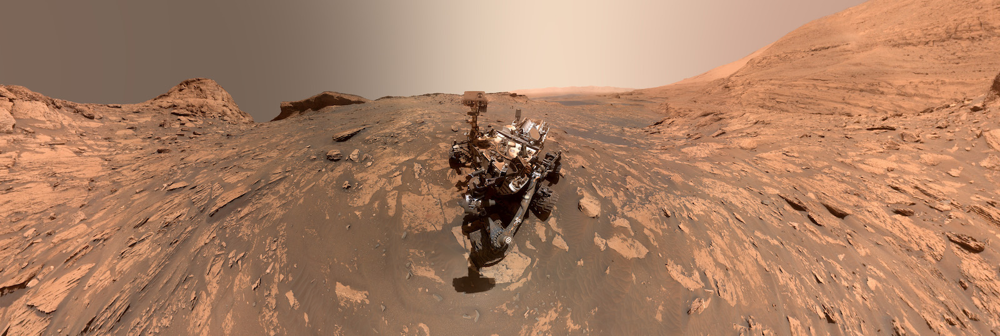

# Mars Spectrometry: Detect Evidence for Past Habitability Competition

*Image courtesy of
[NASA/JPL-Caltech/MSSS.](https://mars.nasa.gov/resources/26384/two-versions-of-a-curiosity-selfie-narrow-and-wide/)*

## General
* **Problem statement:** Build a model to automatically analyze mass spectrometry data collected for Mars exploration in order to help scientists in their analysis of understanding the past habitability of Mars.
* **Type:** Multi-Label Classification
* **Host:** NASA
* **Platform:** Drivendata
* **Competition link:** https://www.drivendata.org/competitions/93/nasa-mars-spectrometry/
* **Placement:** Top 3% (23/713)